# IceRay Ray tracer

 - Description \
    An ancient ray tracer that I finally put in public.

 - Status: \
    Still in development, near beta status.

## Key features:
 - Like any ancient ray tracers posses.

## Examples

### Camera

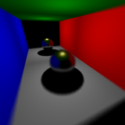

### Geometry

#### Flat

#### Quadric

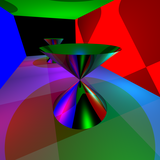
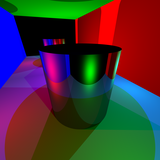
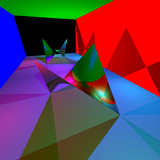
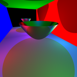
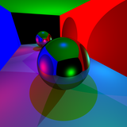

#### Transformation

#### Misc

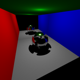

### Light

### Material

#### Illumination

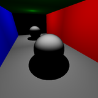
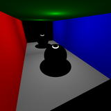
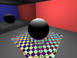
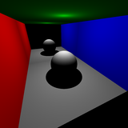

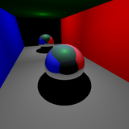
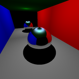

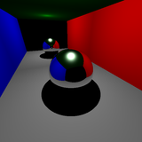

#### Pattern

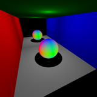
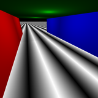
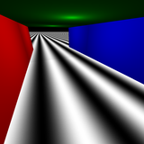
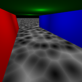

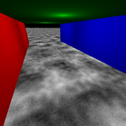
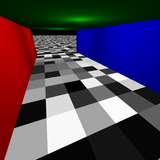

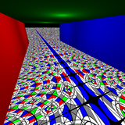

#### Transmission

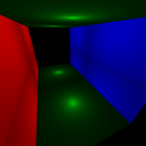
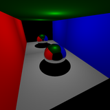

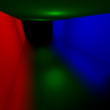

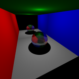

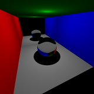
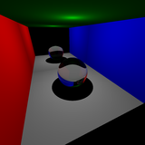

# Install
  - install git
  - install cmake
  - install python
    - pip install scons
    - pip install nucleotide
  - git clone http://github.com/dmilos/IceRay.git
  - git submodule init
  - git submodule update
  - Build using SCons
    - cd ./IceRay/work/build/scons/cdll
    - scons
  - Build using CMake 
    - cd ./IceRay/work/build/cmake
    - run make.bat on Windows or make.sh on Unix
  - put $\src and $\example in to PYTHONPATH path
  - run some examples in $\example\test2
