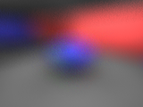
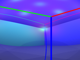
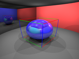
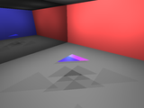
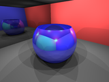
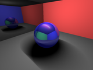
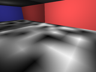
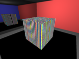

# IceRay Ray tracer

 - Description \
    An ancient ray tracer that I finally put in public.

 - Status: \
    Still in development.

## Key features:
 - Like any ancient ray tracers posses.

## Examples

### Camera










### Geometry

#### Flat




#### Quadric





#### Transformation


#### Misc


### Light





### Material

#### Illumination


#### Pattern







#### Transmission


```python
TODO
```

# Install
  - install git
  - install python
    - install python with dev options
    - pip install scons
    - pip install nucleotide
  - install boost
  - git clone http://github.com/dmilos/IceRay.git
  - git submodule init
  - git submodule update
  - modify ```build/set-env.bat``` according to your configuration
  - run ```build/set-env.bat```
  - cd ./IceRay/work/build/scons/python
  - scons
  - rename *dll/*so from temp/IceRayLib-.../dll to IceRayCpp.pyd and copy in to your PYTHONPATH folder
  - run some examples.


# Boost vs python pre-built binaries
   Boost  | MSVC/Python | MSVC/Python
  ------- |-------------|--------
   1.68   | 120/27      | 140/37
   1.70   | 120/27      | 140/37
  -----------------------------

